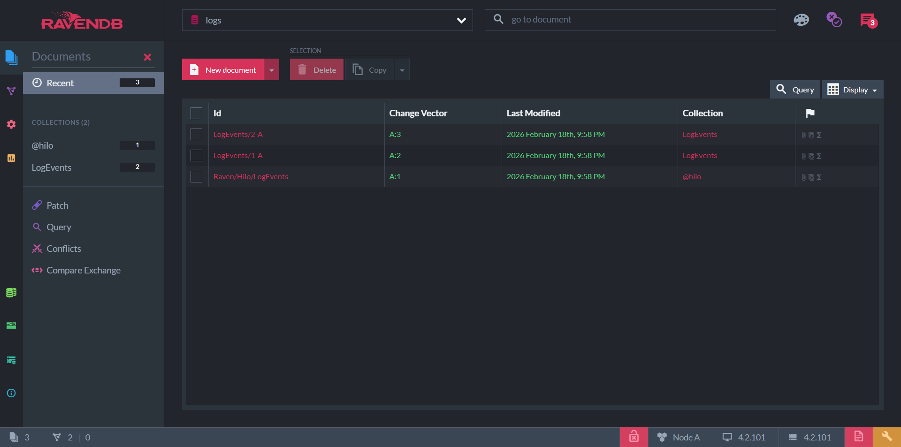
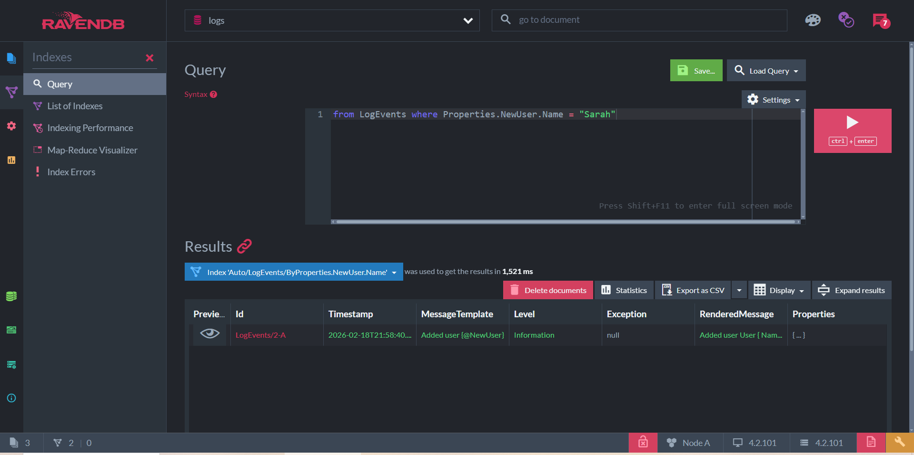

# Modern Structured Logging With Serilog and Seq

## RavenDB

1. Зайти в папку с docker-compose.yml и выполнить

    ```bash
    docker-compose up
    ```

2. Создать базу данных logs.

3. Теперь можно создавать записи и делать выборки.





## Seq

TBD
