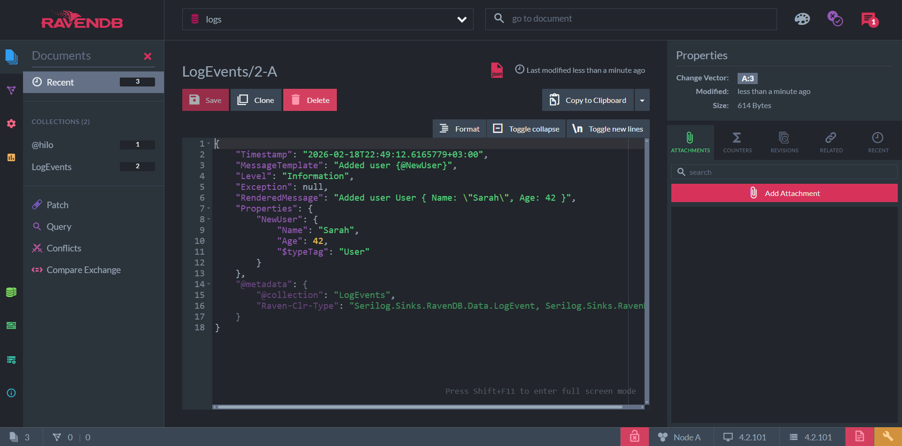
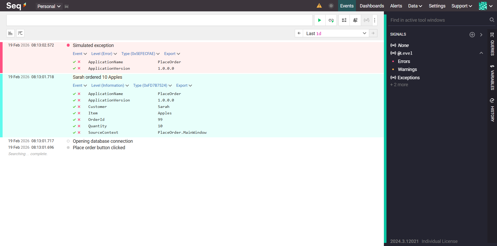
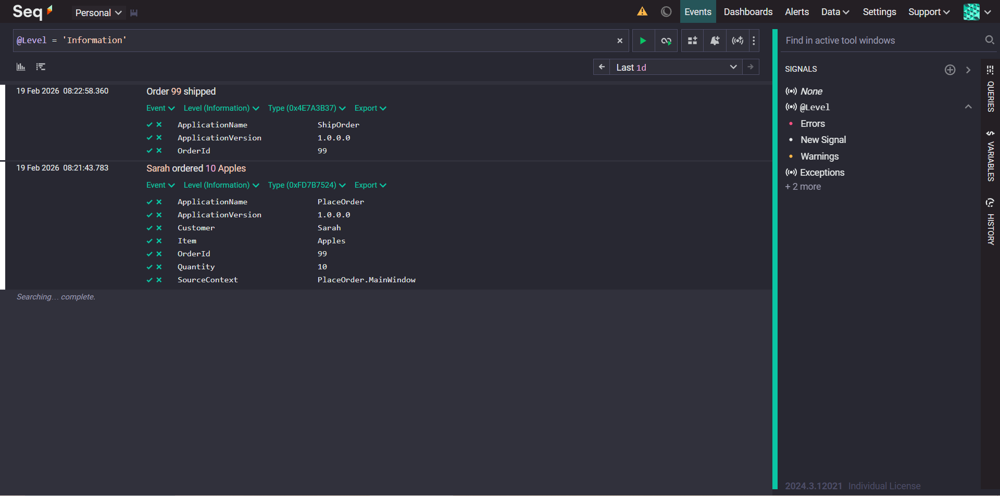

# Modern Structured Logging With Serilog, RavenDB and Seq

## RavenDB

### Вариант 1

1. Зайти в папку с docker-compose.yml и выполнить

    ```bash
    docker-compose up
    ```

2. Создать базу данных logs.

3. Теперь можно создавать записи и делать выборки.





### Вариант 2

Запустить проект **Demo.AppHost**

## Seq

1. Зайти в папку с docker-compose.yml и выполнить

    ```bash
    docker-compose up
    ```

2. Теперь можно создавать записи и делать выборки.




